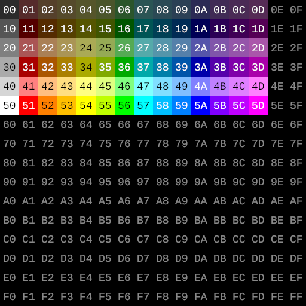
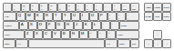
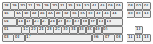

<!--*- word-wrap: t; mode:markdown -*-->

# Clocks

The ARS has a seemingly strange core clock frequency. It experiences 780 clock ticks for every scanline of output. With color NTSC's line rate fixed at &approx;15734.266Hz (exactly 2250/143 kHz), this gives a clock rate of &approx;12.272727MHz (exactly 135/11 MHz.) However, where normal interlaced video signals contain 262.5 lines per field, the ARS's video outputs 262 lines per frame. The framerate is thus &approx;60.05445fps (exactly 1125000/18733 fps).

However, computers output video at 60 frames per second, not 60.05445. If an emulator simulates 204360 clocks per frame, and outputs 60 frames per second, all these clocks will effectively be slowed down by 0.09%; this makes everything else so much simpler that it's worth the hardly noticeable difference.

Here are all the interesting clock rates in the console:

| Clock      | Real ratio  | Real value         | Emulated    | Notes     |
| ---------- | ----------- | ------------------ | ----------- | --------- |
| Core       |   135MHz/11 |      12.2727...MHz |  12.2616MHz |           |
| Dot,APU    |   135MHz/22 |      6.13636...MHz |   6.1308MHz | Core/2    |
| Audio      | 135MHz/2816 | 47.940340909...kHz | 47896.875Hz | Core/256  |
| Colorburst | 39375KHz/11 |   3.57954545...MHz |         N/A | Core*7/24 |

A PAL version of the console was never planned. It likely would have had slightly different clocks.

# Memory Map

A15 might as well be an active-high "cartridge select" signal.

WCS# (Work RAM chip-select) pin is pulled low, which means that any access is a Work RAM access "by default". A discrete transistor drives it high for accesses to `$8000-$FFFF`, which creates the "cartridge space". The PPU drives it high for `$0211`, `$0213`, `$0215`, `$0217`, allowing reads from the VRAM, CRAM, SAM, and SSM memory ports. IO unit drives it high for `$0240-$0247`, even though not all of those addresses are used. A WCS# pin _is_ provided to the cartridge; fancy hardware could drive it high for certain addresses to provide additional read ports in general Work RAM space, provide additional memory banks, etc. (No official hardware does so.)

- `$0000-$7FFF`: Unless otherwise specified below, Work RAM.
- `$0200-$021F`: PPU registers
- `$0211,$0213,$0215,$0217`: PPU memory ports
- `$0220-$023F`: APU control memory
- `$0240,$0241`: Controller ports
- `$0245`: Homebrew Achievements Module
- `$0246`: Emulator configuration
- `$0247`: Developer cartridge debug port
- `$0248,$024F`: Bank select registers. (See Cartridge Memory Map.)
- `$7C00-$7F7F`: Area of work RAM used for Overlay tilemap.
- `$7F80-$7FF7`: Area of work RAM used for Overlay palette selection.
- `$8000-$FFFF`: Cartridge space. (See Cartridge Memory Map.)

Note on registers: Writes to register space write both to the register and to Work RAM. Except for the four read ports (VRAM, CRAM, SAM, SSM) and the IO ports (controllers, etc.), all reads to register space read the Work RAM, not the register. This will return the last value written to the register. This is usually fine. For the *port address* registers, however, this value will not reflect any changes that happened to the registers behind the scenes.

An example of a case where this matters:

- Write `$56` to `$0218`. The VRAM access address becomes `$xx56`.
- Write `$34` to `$0210`. The VRAM access address becomes `$3400`.
- Read `$0218`. You get `$56`.

The read gave the last value the CPU wrote to that address. However, the write to `$0210` cleared the low 8 bits of the underlying register. Since those bits weren't zeroed as the result of a CPU write, there were no corresponding zero bits written to the WRAM, and the value you read does not match the underlying register.

Incrementing the address by reading/writing the VRAM access port will cause similar problems.

# PPU

## Registers

(no mark) Safe at all times, writes take effect immediately  
[+] Writes take effect at some point during next H-blank  
[H] Dangerous during (part of) H-blank, safe at other times  
[O] Dangerous during scan-out, safe at other times

`$0200`: [+]BG scroll X  
`$0201`: [+]BG scroll Y  
`$0202`: [+]

- Bit 0: Swap BGs horizontally (0<->1, 2<->3)
- Bit 1: Swap BGs vertically (0<->2, 1<->3)
- Bit 2: 0 = BG mode 1; 1 = BG mode 2
- Bit 3: Video enable. Checked only at the moment the _first_ hblank occurs. If 0, only black will be output and normal PPU processing is skipped.
- Bit 4-7: High nybble of OL base tile address. `0000` disables the overlay, freeing up about 11.25% of main CPU cycles. Note that unlike other tile data, overlay tile data is fetched from *main* memory, not VRAM.

`$0203`: BG tile bases (top)

- Bit 0-3: High nybble of BG0 base tile address.
- Bit 4-7: High nybble of BG1 base tile address.

`$0204`: BG tile bases (bottom)

- Bit 0-3: High nybble of BG2 base tile address.
- Bit 4-7: High nybble of BG3 base tile address.

`$0205`: Sprite palette info, per background region

- Bit 0-1: High 2 bits of base location in CRAM for sprite palette (in BG0 region)
- Bit 2-3: As above for BG1 region
- Bit 4-5: As above for BG2 region
- Bit 6-7: As above for BG3 region

`$0206`: High 4 bits of base location in CRAM for BG0 palette  
`$0207`: As above for BG1  
`$0208`: As above for BG2  
`$0209`: As above for BG3  
`$020A`: BG0 foreground info

- Bit 0-1: For palette 0: 00 = no foreground colors, 01 = colors 2 and 3 are foreground, 10 = colors 1-3 are foreground, 11 = all colors are foreground
- Bit 2-3: As above for palette 1
- Bit 4-5: As above for palette 2
- Bit 6-7: As above for palette 3

`$020B`: As above for BG1  
`$020C`: As above for BG2  
`$020D`: As above for BG3  
`$020E`: High 5 bits of base location in CRAM for OL palette  
`$020F`: "Color mod" value. Added to the hardware palette index before output. Pretty much only usable for fades. In theory, arbitrary video could be outputted by writing to this register repeatedly *very* quickly...  
`$0210`: VRAM access page; high 8 bits of location from which to access VRAM. Writing this register clears the low 8 bits of the location.  
`$0211`: [HO]VRAM access port.  
`$0212`: CRAM access index.  
`$0213`: [O]CRAM access port.  
`$0214`: SSM access index.  
`$0215`: [H+]SSM access port.  
`$0216`: SAM access index.  
`$0217`: [HO]SAM access port.  
`$0218`: VRAM access byte; low 8 bits of access location. Write the access page _first_ if you intend to write both.  
`$0219`: IRQ scanline number. During H-blank/scan-out, IRQB# wil be asserted if the upcoming/current (respectively) scanline number is greater than or equal to this register's value. A value of 240 will signal IRQ during the entire vblank period. (This is used by ARS DOS to get a maskable vblank interrupt.) Values of 241 and above effectively disable scanline IRQ. Values < 128 will _not_ signal for scanline numbers ≥ 128, as a special case; among other things, this allows a clean scanline 0 IRQ.  
`$021A`: [HO]VRAM DMA. Write `xx` to this, and the PPU will copy `$xx00-$xxFF` as if it were written to `$0211`. This takes 257 cycles, not counting the write to `$021A`.  
`$021B`: [HO]VRAM "splat" DMA. Write `xx` to this, and the PPU will do a "splat copy". Takes 1025 cycles. (See information on BG mode 2.)  
`$021C`: [HO]CRAM DMA. As `$021A`, but writes to CRAM (as if via `$0213`).  
`$021D`: [H+]SSM DMA. As `$021A`, but writes to SSM (as if via `$0215`).  
`$021E`: [HO]SAM DMA. As `$021A`, but writes to SAM (as if via `$0217`), and only transfers 64 bytes, taking 65 cycles. (This means it can't be used to touch $40-FF from any page.)  
`$021F`: [H+]SSM Unpacked DMA. As `$021D`, but reads `$00`, `$40`, `$80`, `$C0`, `$01`, `$41`, ... Simplifies certain OAM processing methods.

Note on PPU ports: Writing a port increments its respective address. Reading does not. This means that a RMW operation (like `INC`) will write the same byte and was read, and increment cleanly. The fastest way to increment the value after a read is to immediately store the same value back, e.g.:

```
    LDA $0211
    STA $0211
```

## VRAM

`$0000-$03FF`: BG0 tilemap  
`$0400-$07FF`: BG1 tilemap  
`$0800-$0BFF`: BG2 tilemap  
`$0C00-$0FFF`: BG3 tilemap  
(All 64KiB of VRAM is accessible for BG or sprite tiles, but using the first 4KiB will usually have silly results, because you may end up interpreting tilemap data as tile data or vice versa.)

Tile data is stored planar style, lowest plane first. Background and Overlay data is 2 bits per pixel, while Sprite data is 3 bits per pixel. Tile data is stored in single-plane blocks of 8x8; a Background tile thus consists of 8 bytes of low-plane data followed by 8 bytes of high-plane data. This is the format understood by most tile editors.

### BG mode 1

In mode 1 (bit 2 of `$0202` is clear), the tilemap consists of a 32x30 array of 8-bit tile numbers, followed by a 16x15 array of 2-bit palettes, each of which applies to a block of 2x2 tiles. (This layout is exactly the same as that of the NES.) Background screens are then 256x240 pixels.

### BG mode 2

In mode 2 (bit 2 of `$0202` is _set_), the tilemap consists of a 32x32 array of bytes. Background screens are then 256x256 pixels. The high 6 bits of each byte are the high 6 bits of that tile's tile number and the low 2 bits are the palette number for that tile. Bit 0 of the tile number is 0 for even rows and 1 for odd rows, and bit 1 of the tile number is 0 for even columns and 1 for odd columns. This gives you square background screens, and lets you specify a different palette index for any given tile, but is somewhat inconvenient if you're not building your backgrounds out of 16x16 "logical" tiles.

About splat DMA:

If you write the same value to each 2x2 block, like so:

    AABBCCDDEEFFGGHHIIJJKKLLMMNNOOPP
    AABBCCDDEEFFGGHHIIJJKKLLMMNNOOPP
    QQRRSSTTUUVVWWXXYYZZ001122334455
    QQRRSSTTUUVVWWXXYYZZ001122334455
    ...

then it is as if we were working with 16x16 tiles instead of 8x8 tiles, and we had an array like:

    ABCDEFGHIJKLMNOP
    QRSTUVWXYZ012345
    ...

The "splat" DMA mode allows you to make your "backing buffer" as though this were the case, and copies the bytes as it writes them to VRAM. But, if you use it, you lose the ability to specify palettes on a per-8x8-tile basis.

## Palette

The ARS palette is based on HSV (hue, saturation, value). `$00`, `$10`, ..., `$50` is a ramp of increasingly bright grays. With `x` in the range `$1`-`$d`, `$1x`, `$3x`, and `$5x` are dark, medium, and bright fully-saturated versions of hue `x`, and `$0x`, `$2x`, and `$4x` are dark, medium, and bright half-saturated versions of hue `x`. All color values `$60`-`$FF` are black.

This layout may seem odd, but it means that subtracting `$20` from a color value gives you a darker version of the color. Therefore, assuming valid color inputs, writing `$E0` or `$C0` to the color mod register is like reducing the brightness. A simple way to do a fade out is to write `$E0`, then `$C0`, then disable video output entirely; and for a fade in, write `$C0`, then `$E0`, then `$00`.

<figure>
<figcaption>Hues</figcaption>
<table>
<thead>
<tr><th>Index</th><th>Hue</th><th>Colors</th></tr>
</tr>
</thead>
<tbody>
<tr><td>$0</td><td>White</td><td></img></tr>
<tr><td>$1</td><td>Red</td><td></img></tr>
<tr><td>$2</td><td>Orange</td><td></img></tr>
<tr><td>$3</td><td>Pale Orange</td><td></img></tr>
<tr><td>$4</td><td>Yellow</td><td></img></tr>
<tr><td>$5</td><td>Yellow-Green</td><td></img></tr>
<tr><td>$6</td><td>Green</td><td></img></tr>
<tr><td>$7</td><td>Cyan</td><td></img></tr>
<tr><td>$8</td><td>Turquoise</td><td></img></tr>
<tr><td>$9</td><td>Aqua</td><td></img></tr>
<tr><td>$a</td><td>Blue</td><td></img></tr>
<tr><td>$b</td><td>Deep Purple</td><td></img></tr>
<tr><td>$c</td><td>Purple</td><td></img></tr>
<tr><td>$d</td><td>Magenta</td><td></img></tr>
</tbody>
</table>
</figure>

<figure>
<figcaption>Whole palette</figcaption>

</figure>

**Note that `$00` is not completely black!**

The ARS PPU outputs one of these colors for each pixel. Its output is hooked directly to a ROM that contains these color values in RGB. Normally that ROM controls an NTSC signal generator, but the board also has an unsoldered header (perfect for adding a DB-25 plug) that allows direct access to the digital RGB signal. It exposes 18 color pins, an HSYNC pin, a VSYNC pin, two ground pins, two +5V pins, and leaves one pin floating. There are circuit diagrams floating around out there for converting this signal into various analog signal formats.

## Sprites

### SSM

256 bytes, 4 per sprite.

`$0`: X coordinate  
`$1`: Y coordinate  
`$2`:

- Bit 0: Horizontal flip
- Bit 1: Vertical flip
- Bit 2: Foreground bit
- Bit 3-7: Bits 3-7 of tile address

`$3`: High 8 bits of tile address

(Low 3 bits of tile address are always zero.)

The coordinates are the pixel position of the upper-leftmost pixel occupied by the sprite on the screen, regardless of the horizontal and vertical flip bits. A Y coordinate >=240 will put every pixel of the sprite outside the screen area, effectively disabling it.

SSM port accesses will create bus conflicts if performed during the final 192 cycles of an H-blank, and are safe at other times.

### SAM

64 bytes, 1 per sprite.

- Bit 0-2: Palette number
- Bit 3-7: (Height in tiles-1)

SAM port access will create bus conflicts during the cycle before each 3-cycle "sprite prefetch" block of the H-blank, and will also create a bus conflict in every "dot out" cycle whose dot comes from a sprite. Safe at other times.

## Overlay

If any of the high 4 bits of `$0202` are set, the Overlay is enabled. It is very similar to the background layer, with some differences:

- Tilemap and tiles are stored in main memory (Work RAM or cartridge space), not VRAM
- No hardware scrolling
- Palette index 0 is transparent (the CRAM value is not used). Any other palette index overrides the pixel color. (i.e. overlay is always "in front of" sprites and backgrounds)

Having the Overlay enabled steals about 11.25% of main CPU cycles. Given the ARS CPU's ridiculous clockspeed, there are plenty of those to go around, but if you really need every cycle you can get a small speedup by disabling the Overlay when it's not in use. You can enable/disable the overlay at any time, even in the middle of a scanline, though the precise timing is finicky. More commonly, the overlay gets enabled and disabled from a scanline IRQ, based on whether it is needed in the upcoming scanline.

A major advantage of the Overlay over other types of graphics is that it can be written freely and safely at all times. SimpleConfig, included with the ARS emulator, uses the Overlay along with some scanline trickery to create a 2-bpp framebuffer. Many games (and ARS DOS) use it to implement bitmapped text, with varying degrees of sophistication.

The Overlay is a 32x28 tilemap. The first and last rows are repeated to produce a full 256x240 pixel image. (The repeated rows are normally invisible due to overscan, but are pretty off-putting if you can see them.) Tile numbers are stored straightforwardly, one byte per tile, starting at `$7C00`. Each tile has a corresponding bit starting at `$7F80` which allows a choice between two palettes.

The area of memory space where tile *data* is fetched from is given by the high nybble of the `$0202` register. With `$X?` in that register, tiles are fetched from `$X???` of main memory. This register is latched at the beginning of scan-out, so you can't change the tile data mid scanline. These memory accesses act the same way as CPU reads do. Because of this, tile data can come just as easily from ROM or from RAM.

# Controller ports

## Pinout

The controller ports use a DA-12 connector. Looking at the (female) controller plug, pins are numbered starting in the upper left and going left to right, top to bottom. There should be two rows of six pins, with the upper row offset to the right of the lower row.

1. Vcc (+5V)
2. Blank
3. D7#
4. D6#
5. D5#
6. D4#
7. D3#
8. D2#
9. D1#
10. D0#
11. Strobe
12. GND

Note that Dx# are active-low. The D pins are pulled high (logic 0), and driven low (logic 1).

The Blank pin is used by the light pen and light gun to synchronize with a CRT display; other controllers leave it unconnected. It's driven to a *positive* voltage when the PPU is *not* outputting video, and (almost) to zero volts when it *is*. The voltages vary wildly depending on temperature, phase of the moon, etc. but are usually in the [-0.1, +0.2] volt range in frame and [+0.9, +1.5] volt range out of frame. Somehow, this was enough for pretty reliable phase lock. It's driven directly by one of the pins of the video circuitry, so you can screw up the video signal by adding too much capacitance to this line!

## Access

`$0240`: Controller port 1  
`$0241`: Controller port 2

Writing to a port drives Strobe to +5V and any active Dx pins to 0V. Reading from a port drives Strobe to 0V and returns what is currently sensed on the Dx# pins. Because of the capacitance of the D lines, the read should be performed twice, once to bring Strobe to 0V, and a second time so that any 1s being driven by the console can drain out and to allow time for the controller to drive the lines.

Controllers return a fixed ID when `$80` is written. ET games give a "no controller" message if `$00` is read, or "wrong controller" if something other than `$01` is read.

In theory, this interface can be used to provide ~1.5MB/s transfers under CPU control, if you keep the cable really short.

## Standard controller

A pretty boring boxy controller with three face buttons, an 8-way hat switch, and a big central Pause button. Clearly inspired by the NES controller, clearly designed by an engineer.

`write $00`: Get button state  
`write $80`: Get controller ID (`$01` for the standard controller)

The standard controller ignores the low 7 Dx# pins on input.

Button state:

- Bit 0: A
- Bit 1: B
- Bit 2: C
- Bit 3: Hat Left
- Bit 4: Hat Up
- Bit 5: Hat Right
- Bit 6: Hat Down
- (Bit 7 always 0)

Pause button asserts all Hat bits (bits 3-6). I'm not sure why this is the case, since there was one entire bit unused in this report that could have been used for Pause. Maybe it's a remnant of the development process, or maybe it's reserved for future expansion.

## Keyboard

A 70-key keyboard with mechanical switches. Apart from a few oddities (like Control's placement and the twin delete keys), this is remarkably similar to a modern PC keyboard. I find it pretty pleasant to type on.

ARS DOS only handles keyboards plugged into the second port (`$0241`).

`write $00`: Get next key press/release  
`write $80`: Get controller ID (`$02` for a keyboard)

The keyboard ignores the low 7 Dx# pins on input.

- Bit 0-6: Key scancode
- Bit 7: 0 ("positive") for press, 1 ("negative") for release

<figure>
<figcaption>Keyboard layout with key caps</figcaption>

</figure>

<figure>
<figcaption>Keyboard layout with scancodes</figcaption>

</figure>

Scancode table:

- `$01`: Left Shift
- `$02`: Left Alt
- `$03`: Left Meta
- `$04`: Control
- `$05`: Right Shift
- `$06`: Right Alt
- `$07`: Right Meta
- `$08`: Escape
- `$09`: Backward Delete
- `$0A`: Forward Delete
- `$0B`: Insert
- `$0C`: Break
- `$0D`: Home
- `$0E`: End
- `$0F`: Page Up
- `$10`: Page Down
- `$11`: Left Arrow
- `$12`: Up Arrow
- `$13`: Right Arrow
- `$14`: Down Arrow
- `$15`: Enter
- `$16`: Tab
- `$17`: Space
- `$18`: \` ~
- `$19`: 1 !
- `$1A`: Q
- `$1B`: A
- `$1C`: Z
- `$1D`: 2 @
- `$1E`: W
- `$1F`: S
- `$20`: X
- `$21`: 3 #
- `$22`: E
- `$23`: D
- `$24`: C
- `$25`: 4 #
- `$26`: R
- `$27`: F
- `$28`: V
- `$29`: 5 %
- `$2A`: T
- `$2B`: G
- `$2C`: B
- `$2D`: 6 ^
- `$2E`: Y
- `$2F`: H
- `$30`: N
- `$31`: 7 &amp;
- `$32`: U
- `$33`: J
- `$34`: M
- `$35`: 8 *
- `$36`: I
- `$37`: K
- `$38`: , &lt;
- `$39`: 9 (
- `$3A`: O
- `$3B`: L
- `$3C`: . &gt;
- `$3D`: 0 )
- `$3E`: P
- `$3F`: ; :
- `$40`: / ?
- `$41`: - _
- `$42`: [ {
- `$43`: ' "
- `$44`: \ |
- `$45`: = +
- `$46`: ] }

## Mouse

A boxy two-button ball mouse. Really, really uncomfortable. When I first saw this mouse, I thought it was the ugliest mouse I've ever seen. Since then, I've seen the mouse Acorn shipped with the BBC Master 512 microcomputer, and now I consider the ARS mouse the *second* ugliest mouse I've ever seen.

Mice are normally plugged into the first port (`$0240`) when used with a keyboard.

`write $00`: Get button state  
`write $40`: Get (and reset) the X movement counter  
`write $80`: Get controller ID (`$03` for a mouse)  
`write $C0`: Get (and reset) the Y movement counter

The ARS mouse ignores the low 6 bits of Dx# on input.

Button state:

- Bit 0: Left button
- Bit 1: Right button
- (Bit 2-7 always 0)

X/Y movement is an 8-bit two's complement integer.

Example simplified read procedure (cursor bounding logic is left out):

```6502
    ; Read button state
    STZ $0241
    LDA $0241 ; (bring Strobe down)
    LDA $0241 ; (actual read)
    STA g_MouseButtons
    ; Read X movement
    LDA #$40
    STA $0241
    LDA $0241 ; (bring Strobe down)
    LDA $0241 ; (actual read)
    ; ...and add it to the cursor position
    CLC
    ADC g_CursorX
    STA g_CursorX
    ; Read Y movement
    LDA #$C0
    STA $0241
    LDA $0241 ; (bring Strobe down)
    LDA $0241 ; (actual read)
    ; ...and add it to the cursor position
    CLC
    ADC g_CursorY
    STA g_CursorY
```

## Light pen

This is the most metal light pen I've ever seen. By that I mean that its casing is actually metal. I think they built the electronics inside of an otherwise real pen housing, but I can't be sure. If they designed a metal pen body from scratch just for this thing, that would absolutely be par for the course for a late-80's Eiling Technologies product, but since it's the same electronics as the light gun, I think they developed the light gun first and then somebody tried to fit it into a pen they had lying around.

Same ID as the light gun. Button bits 3-6 are always 0 on the light pen, since the pen lacks a mode selector switch. This is the only way for software to tell them apart.

Light pens are normally plugged into the second port (`$0241`) when used with a controller, or the first port (`$0240`) when used with a keyboard.

`write $00`: Get button state  
`write $40`: Get X position in frame, 0-255. Only valid if the in-frame bit is 1.  
`write $80`: Get controller ID (`$04`)  
`write $C0`: Get Y position in frame, 0-239. Only valid if the in-frame bit is 1.

The light gun and light pen ignore the low 6 Dx# bits on input.

Button state:

- Bit 0: "Press" registered
- Bit 1: Clicker button is currently held ("eraser mode"?)
- (Bit 2-6 always 0)
- Bit 7: In-frame

## Light gun

A needlessly realistic (and big, and heavy) accessory that, apart from the huge controller cable coming out of the magazine well, looks way too much like a real M16A2 assault rifle. Like the pen, this has some real metal parts. Why?!

Same ID as the light pen. Button bits 3-6 are always 0 on the light pen, since the pen lacks a mode selector switch. This is the only way for software to tell them apart.

Light guns are normally plugged into the second port (`$0241`) when used with a controller, or the first port (`$0240`) when used with a keyboard.

`write $00`: Get button state  
`write $40`: Get X position in frame, 0-255. Only valid if the in-frame bit is 1.  
`write $80`: Get controller ID (`$04`)  
`write $C0`: Get Y position in frame, 0-239. Only valid if the in-frame bit is 1.

The light gun and light pen ignore the low 6 Dx# bits on input.

Button state:

- Bit 0: Main trigger
- Bit 1: Underbarrel trigger
- Bit 2: Thumb button (reload)
- Bit 3: Auto selected
- Bit 4: Burst selected
- Bit 5: Single selected
- Bit 6: Safe selected
- Bit 7: In-frame

Exactly one of bits 3-6 is normally 1. Reading all four as 0, or more than one as 1, means you should reuse the read from the previous frame for debounce purposes. (Or maybe it's a light pen and not a light gun! Or maybe it's a light gun but the switch broke off! WHO KNOWS?!!)

# Developer cartridge

Official "developer cartridges" for the ARS have a lot of special hardware. Reverse engineering the whole cartridge would be hard, given how complex it is, and not very useful, given the limitations compared to a modern solution. Nevertheless, all information I have is documented here.

If anybody manages to find actual documentation for the developer cartridges, please let me know. There are lots of old, working dev cartridges out there, but as far as I know no copies of the manuals that came with them have survived.

## Serial port

The serial port is the only "developer cartridge" feature specifically implemented by the emulator. It only emulates the write end of the port, and it emulates it at infinite speed; write a byte to `$0247` and that byte will be written to stderr, read a byte and the V bit will be set.

Emulation of the debug port must be enabled with a command line option *and* specified in the game's manifest in order to function.

(If you are implementing an emulator or a homebrew program, you probably do not need the rest of this section.)

Developer cartridges have an RS-232 port built-in. It's a standard DB-25 connector, except that the cartridge side seems to require +12V on pin 9 and -12V on pin 10. There is evidence that this was compatible with the serial ports used on Eiling minicomputers, but unfortunately more information on that topic is hard to come by. (Most third-party development couldn't actually have been on Eiling minicomputers—they weren't exactly common—but I haven't yet found any firsthand information on adapters, etc. for non-Eiling hardware.)

When the ARS is running, the port is mapped to `$0247`. Reading it returns the next byte in the read buffer, or sets the V bit if another byte isn't available yet. Writing it puts another byte into the write buffer, or sets the V bit if there wasn't yet room in the buffer. The serial port is hardcoded to 19200 baud, 8 data bits, 1 stop bit, odd parity. Hardware flow control is used. Nearly every pin on the connector goes somewhere on the board, but I haven't found any uses for them.

## IPL

Game Folders may specify arbitrary ROM/RAM mappings, including those supported by the Developer Cartridge and its IPL. That is as close as ARS-emu comes to supporting the Dev Cartridge IPL.

(If you are implementing an emulator or a homebrew program, you probably do not need the rest of this section.)

The cartridge includes a built-in microcontroller, which I refer to as the IPL, short for Initial Program Loader. It's active whenever the console is in reset or powered off(?!), and I think there's a way to "pause" the main console and temporarily reactivate the IPL, but I couldn't get this working reliably. It communicates with a host system over the serial port. It seems to speak a compact binary protocol of some kind. I didn't get far in reverse engineering the protocol, and I wasn't able to dump the microcontroller's ROM. I was able to figure out the commands for reading and writing the memory slots and the console's memory bus. Also found a lot of commands that seem to crash the IPL. Not much else. The IPL controls the BSx pins, but I never found the commands for manipulating them.

Bizarrely, the cartridge includes its own 32KiB SRAM chip that maintains a shadow copy of the WRAM, separate from the IPL. I guess this was useful for debugging. Perhaps an early version of the console used DRAM instead of SRAM, and didn't retain its data during reset?

## Memory slots

(If you are implementing an emulator or a homebrew program, you probably do not need this section.)

The cartridge contains four 30-pin SIMM slots. The four slots are identical, and are labeled as follows:

1. ROM1
2. ROM2
3. DRAM
4. SRAM

SIMMs must be capable of single-cycle operation at 12.273MHz. If there's a way to communicate to the IPL or the glue logic how large the modules are, I wasn't able to find it.

The cartridge also contains a bank of eight DIP switches that control how the B6/B7 pins select between the slots. The switches are grouped in pairs, and each pair controls which chip is selected by a given B6/B7 combination. These switches can be used to describe the mappings of every official cartridge. (Coincidence?!)

Since SIMMs contain DRAM, the dev cartridge has a DRAM controller that issues refreshes every so often. It seems to slow down the system by about 0.5% compared to a regular cartridge. It won't attempt to steal cycles a DMA operation or an overlay fetch, even if only WRAM is involved and it theoretically could have done so.

# APU

The ET-209 audio processor is clocked at half the main system clock. It accesses its registers during the rising phase of each cycle. There's a clever bit of hardware that causes writes to `$0220-$023F` to stall for one extra CPU cycle on even-numbered CPU cycles, so that the APU's registers will only be accessed during the (safe) second phase of the cycle. This extra access latency is often not emulated for performance reasons.

Note that even though `$0227` is not used, writes to this address can still stall the MPU by one cycle, because that address still decodes to APU space!)

- `$0220-$0226`: Voice rates, low
- `$0228-$022E`: Voice rates, high + slide
- `$022F`: Noise period (in units of 1/16 APU clock == 1/32 main clock)
- `$0230-$0236`: Voice waveforms
- `$0237`: Noise waveform
- `$0238-$023E`: Voice volumes
- `$023F`: Noise volume

## Noise

The ET-209 uses a 15-bit LFSR to produce white-ish noise. The APU "block clock" (1/16th APU clock, 1/32nd main clock) is divided by `$022F`+1 to clock the LFSR. Thus, higher `$022F` values produce a greater divisor, and therefore noise with a lower "pitch". In each block, the current output of the LFSR (1 or 0) is added to a counter, and in the final block that counter is modulated into the output samples as if it were an eighth voice output.

The volume register is just as with the voices. The high bit resets the LFSR.

The noise waveform register makes things a little more complicated. The low 7 bits control whether that block advances the period. If bit 0 is set, the period does not advance in block 0, and etc. all the way up to bit 6. Bit 7 is different. Block 7 always advances; bit 7 instead controls which bit of the LFSR is the second tap. If bit 7 is 0, the tap is bit 1, making white noise. If it is 1, the tap is bit 6, making hideous periodic noise. In either case, the noise produced is uncannily like a NES's.

Some useful noise waveforms:

- `$00`: Plain white noise, full rate
- `$55`: Plain white noise, half rate (half of blocks are skipped)
- `$77`: Plain white noise, quarter rate (3/4 of blocks are skipped)
- `$80`: Hideous periodic noise, full rate
- `$D5`: Hideous periodic noise, half rate
- `$F7`: Hideous periodic noise, quarter rate

This noise generator is capable of closely matching a NES's noise generator. It could be a coincidence; a 15-bit LFSR happens to be a convenient way to generate white noise on the cheap. On the other hand, bit 7 of the waveform register perfectly mimics a bizarre (IMO) feature of the NES APU...

Here are the ET-209 period and waveform values that come closest to matching particular NTSC NES period values:

<table>
<thead><tr><th>NES</th><th>Period</th><th>Waveform</th><th>NES</th><th>Period</th><th>Waveform</th></tr></thead>
<tbody>
<tr><td>$0</td><td>$00</td><td>$00</td><td>$1</td><td>$01</td><td>$00</td></tr>
<tr><td>$2</td><td>$02</td><td>$00</td><td>$3</td><td>$06</td><td>$00</td></tr>
<tr><td>$4</td><td>$0D</td><td>$00</td><td>$5</td><td>$14</td><td>$00</td></tr>
<tr><td>$6</td><td>$1A</td><td>$00</td><td>$7</td><td>$21</td><td>$00</td></tr>
<tr><td>$8</td><td>$2A</td><td>$00</td><td>$9</td><td>$35</td><td>$00</td></tr>
<tr><td>$A</td><td>$51</td><td>$00</td><td>$B</td><td>$6C</td><td>$00</td></tr>
<tr><td>$C</td><td>$A2</td><td>$00</td><td>$D</td><td>$D9</td><td>$00</td></tr>
<tr><td>$E</td><td>$D9</td><td>$55</td><td>$F</td><td>$D9</td><td>$77</td></tr>
</tbody>
</table>

(Note that the values in FamiTracker are backwards; F = 0, E = 1, etc.)

## Voices

Each voice has an internal accumulator, to which the given Rate value is added once per sample. The high bits of the accumulator are used to generate the amplitude for that voice, depending on the selected Waveform.

Rate is the value (minus one) added to the accumulator on each output sample. The mapping between rate values and frequencies is:

    freq = rate * 47940.341 / 65536
    rate = freq * 65536 / 47940.341

As an example, assuming you wanted to output a standard "middle A" (440Hz):

    rate = 440 * 65536 / 47940.341 = 601.49426137791...

A rate value of 601 is as close as you can get. It works out to be within 0.5Hz of the correct frequency. Subtract 1, and the value you write to the rate register is 600.

The high 2 bits of the rates control hardware pitch slides. When enabled, writes to the rate registers will not immediately change the rate. An internal rate register will instead slide *toward* the selected rate value at a given rate.

`00`: Instantaneous change  
`01`: Four samples per 1-unit change (~8767.2Hz/s)  
`10`: Eight sample per 1-unit change (~4383.6Hz/s)  
`11`: Sixteen samples per 1-unit change (~2191.8Hz/s)

Waveform bits:

- Bit 0: Invert 0-12.5%
- Bit 1: Invert 0-25%
- Bit 2: Invert 0-50%
- Bit 3: Invert all (toggled on carry if bit 4)
- Bit 4: Toggle "invert all" bit on carry
- Bit 5: Output accumulator
- Bit 6 and 7: Pan (see below)

If bit 5 (output accumulator) is set, then the high bits of the accumulator are the output signal (producing a triangle or sawtooth wave). If it's clear, then the output signal is all zeroes (and periodically inverting it produces a square wave).

The invert bits change the polarity of the output based on the value in the accumulator. Bit 0, for example, inverts the polarity of the output when the accumulator is between 0% and 12.5% of its maximum value, making a square wave with a 12.5% (1/8) duty cycle. Invert bits stack. e.g. if bit 0 and 1 are set, this will invert between 0% and 25%, but invert again between 0 and 12.5%, meaning that, overall, it will be inverted between 12.5% and 25%.

The output is then modulated with the volume and mixed with the other voices.

Some useful waveforms:

- `$10`: Simple square wave (1/2 rate)
- `$01`: 12.5% duty cycle pulse wave, like NES duty cycle 0 (1x rate)
- `$02`: 25% duty cycle pulse wave, like NES duty cycle 1 (1x rate)
- `$04`: Simple square wave, like NES duty cycle 2 (1x rate)
- `$09`: Inverted 25% like NES duty cycle 3 (1x rate)
- `$20`: Sawtooth wave (1x rate)
- `$30`: Triangle wave (1/2 rate)
- `$F0`: Boosted triangle wave, good for bass

Pan values:

- `00`: Center. The voice will be played on both speakers at half volume. (Unless the speakers are out of phase, this results in the same net volume as Left or Right.)
- `01`: Right. The voice will be played at full volume, but only on the right speaker.
- `10`: Left. The voice will be played at full volume, but only on the left speaker.
- `11`: Boosted. The voice will be played at full volume in both speakers. This is used almost exclusively with triangle waves, which are much quieter than the other available waveforms. (Unless the speakers are out of phase, this results in double the volume of Center/Left/Right.)

Volume bits:

- Bit 0-6: Volume (0=mute, 64=max. 63 is NOT max!)
- Bit 7: Reset Accumulator. Should be set on each note-on. Internally set to 0 each tick.

## PCM

If you have nothing better for the main CPU to do, you can perform bit-banged PCM. Write the magnitude to the volume register, and write a waveform of `$00` for negative polarity and `$08` for positive polarity. Wait until 256 MPU cycles have passed, then repeat. Pray for phase-lock. This won't work with most emulators.

## Timing

There are 128 APU clocks per output sample. They are divided into 8 blocks of 16 cycles each. Noise processing occurs at the beginning of each block. The first 7 blocks process each voice in turn. In the eighth block, the noise and voices are mixed, and then the output to the DAC is updated.

Emulators don't usually emulate the precise timing below the sample level, for performance reasons. Some even process the APU in chunks, once per frame; while this generally works well, this breaks the PCM trick.

Voice block cycle timings:

1. Read target rate high byte
2. Read actual rate high byte, begin comparison for slide
3. Read target rate low byte
4. Read actual rate low byte
5. Write actual rate low byte, load accumulator into first adder A
6. Write actual rate high byte, load actual rate into first adder B
7. Read volume register into multiplier A, write {Q,0} (depending on reset flag) into accumulator
8. Evalute waveform, load waveform sample into multiplier B
9. Add LFSR state to noise counter
10. Read noise waveform, increment noise accumulator, clock LFSR on overflow
11. (dead cycle?)
12. (dead cycle?)
13. (dead cycle?)
14. Read multiplier Q, shift/mask and write to both adder As
15. Read sample accumulators into adder Bs
16. Write adder Qs to sample accumulators

Mix block cycle timings:

1. (dead cycle?)
2. (dead cycle?)
3. (dead cycle?)
4. (dead cycle?)
5. (dead cycle?)
6. (dead cycle?)
7. Read noise volume register into multiplier A, reset noise accumulator if reset flag was set in volume register
8. Write noise counter into multiplier B
9. Add LFSR state to noise counter (which is zeroed at the rising edge of this cycle)
10. Read noise waveform, increment noise accumulator, clock LFSR on overflow
11. (dead cycle?)
12. (dead cycle?)
13. (dead cycle?)
14. Read multiplier Q into both adder As
15. Read sample accumulators into both adder Bs
16. Write adder Qs to DAC latches, and 0 to sample accumulators

(Note: the above timing information turned out to be slightly wrong, TODO put the results of that experiment here)

# Cartridge Memory Map

The ARS can be thought of as providing a 20- to 23-bit address bus, depending on the bank size. The high 8 bits of the address come from the appropriate Bank Select register, and the remaining low bits from the accessed address.

The cartridge connector has two pins, BS0 and BS1, which effectively control the bank size. Cartridges usually hardwire them to a particular logic value, and connect (or don't connect) their Ax/Bx pins as needed.

- 0: 1x32KiB slot
  - `$8000-$FFFF`: Bank Select 0 (`$0248`)
- 1: 2x16KiB slots
  - `$8000-$BFFF`: Bank Select 0 (`$0248`)
  - `$C000-$FFFF`: Bank Select 4 (`$024C`)
- 2: 4x8KiB slots
  - `$8000-$9FFF`: Bank Select 0 (`$0248`)
  - `$A000-$BFFF`: Bank Select 2 (`$024A`)
  - `$C000-$DFFF`: Bank Select 4 (`$024C`)
  - `$E000-$FFFF`: Bank Select 6 (`$024E`)
- 3: 8x4KiB slots
  - `$8000-$8FFF`: Bank Select 0 (`$0248`)
  - `$9000-$9FFF`: Bank Select 1 (`$0249`)
  - `$A000-$AFFF`: Bank Select 2 (`$024A`)
  - `$B000-$BFFF`: Bank Select 3 (`$024B`)
  - `$C000-$CFFF`: Bank Select 4 (`$024C`)
  - `$D000-$DFFF`: Bank Select 5 (`$024D`)
  - `$E000-$EFFF`: Bank Select 6 (`$024E`)
  - `$F000-$FFFF`: Bank Select 7 (`$024F`)

When reset falls, all Bank Select registers are initialized to the value currently present on Bx. The cartridge should weakly pull those pins either up or down to give the Power On Bank number. Every single cartridge I've seen (except the Dev Cartridge) pulls these to ground.

## The Technical Truth

Internally, the ARS always uses Bank Select 0 for `$8xxx`, Bank Select 1 for `$9xxx`, etc. The BSx pins actually control the granularity of writes to the Bank Select registers. With a value of 0, for example, writing any address from `$0248-$024F` actually writes that value to all eight Bank Select registers. With a value of 1, writing an address from `$0248-024B` writes Bank Select registers 0 through 3, etc. This starts to become noticeable if you have BSx other than 3, and write to the "missing" Bank Select registers. There are additional considerations when reading BSx, because of the way register reads work on the ARS.

# ARS DOS cartridge

If you are writing a game and want to use the floppies, you should probably use ARS DOS instead of talking to the floppy controller directly. Not only does it have an API for disk access, it comes with some handy bonus routines.

I don't have any physical examples of this hardware. The following information is pieced together mainly from a copy of the ARS DOS 1.4 ROM that found its way into a couple official cartridge-based games, which use its bitmap font and its math routines. Perhaps they were developed as ARS DOS applications, before the advent of the Dev Cartridge.

The ARS DOS cartridge contained a small BIOS ROM, a SIMM slot, and a self-contained floppy controller much like the VIC-1541. Communication with the floppy controller is via a synchronous IO port mapped at `$0242`. Like the debug port, the floppy IO port uses the Set Overflow pin for flow control. To write a byte to the port, you use a loop like:

```6502
-   CLV
    LDX $0242   ; Check that nothing unexpected has shown up
    BVS +       ; No error if no byte
    BEQ +       ; No error if a raw zero was read
    BRA @Error  ; Something unexpected, probably an error
+   CLV         ; Clear the overflow flag
    STA $0242   ; Try writing the byte
    BVS -       ; If overflow, start over
```

To read from the port, use a simpler loop:

```6502
-   CLV         ; Clear the overflow flag
    LDA $0242   ; Try reading the byte
    BVS -       ; If overflow, start over
```

Like the VIC-1541, the main CPU uses a simple, high-level interface that abstracts away details of the filesystem and physical layer. Unfortunately, this means that I don't know anything at all about the filesystem or the physical layer. I don't even know how big the floppies were. 3.5"? 5.25"? 8"?! The only thing I do know is that sectors are apparently 256 bytes, and that floppies could store more than 64K but less than 16M.

The floppy controller apparently spams zero whenever it is not executing a command, and aborts the reading of a command if it reads a zero. ARS DOS sends a zero, then reads repeatedly until it gets at least one zero, before sending any command, and expects to read one more zero byte before receiving the reply. When sending data, `$00` and `$FF` are sent as `$FF $01` and `$FF $80`, respectively—and, when sending a command from the ARS to DOS, `$0A` is sent as `$FF $0A`.

## Commands

Commands are started by a single character, and terminated by a newline (`$0A`). The response is either `E` (short for error?), or `O` (short for OK?) followed by a reply.

A `<drive>` is either A or B, and designates which floppy drive to use. A `<name>` is a space-padded, capitalized, 8.3 filename without the dot (always 11 bytes). DOS heavily restricts the allowed characters, and ars-emu respects those restrictions. A `<handle>` is a single character used as a handle to an open file. DOS will mostly refuse to deal with handles that aren't ASCII decimal digits. A `<size>` is 24-bit, big-endian. A `<sector>` is 16-bit, big-endian. (Little endian would have been more natural for a 6502 based system, but Eiling minis all seem to have been big-endian.)

- `Q`: After the SIMM check, DOS sends this command. If it doesn't get an `E` reply, it hangs.
- `s<drive>`: Drive status. `E` is a major failure. `O0` means no disk. `O1` means disk present and writable. `O2` means disk present but write protected. Any other byte causes DOS to prompt if you want to format the disk.
- `F<drive>`: Erase and format a disk. The DOS `FORMAT` command does this. ars-emu implements this, but in a very fake way that doesn't erase anything.
- `K<drive>`: Check the disk. I guess. The DOS `CHECK` command does this. ars-emu just waits ten seconds or so and then replies `O` on any valid, mounted drive, which satisfies `CHECK`.
- `c<source drive><dest drive>`: Create a block-for-block copy of the source disk. The DOS `CLONE` command does this. ars-emu doesn't implement this.
- `M<drive><source name><destination name>`: Rename (move) a file. ARS DOS always deletes the destination file before attempting this. On some platforms, ars-emu will silently overwrite an existing destination, on others, there will be an error. (Note that this command doesn't support cross-drive operation; when ARS DOS wants to do a cross-drive `move`, it emulates it by copying the file—agonizingly slowly!—and deleting the source.)
- `D<drive><name>`: Delete a file. ARS DOS seems to expect this to fail on nonexistent files, so ars-emu does so.
- `l<drive>`: List all files on drive. Response is described below.
- `(<drive><name>`: Open an existing file. A successful response includes a handle for the new file.
- `C<drive><name>`: Create a new file. A successful response includes a handle for the new file. ARS DOS seems to think this will fail if the file already exists.
- `)<handle>`: Close an open handle. DOS sends a lot of these, and ignores errors when doing so.
- `R<handle>`: Read a sector and advance the file pointer. Always reads a whole sector. When reading the last sector of *any* file, *including a non-sector-sized one*, DOS assumes this will *not* advance the file pointer.
- `W<handle>`: Write a sector and advance the file pointer. The data to write will follow the newline. Always write a whole sector of data, even if you're writing the last sector of a non-sector-sized file. If DOS believes a file is going to expand, it does a `T` before beginning the write, so presumably a `W` will never grow the file on its own. When writing the last sector of *any* file, *including a non-sector-sized one*, DOS assumes this will *not* advance the file pointer.
- `T<handle><size>`: Truncate *or grow* a file to the given size. This appears to be the only way to alter a file's size. DOS assumes that this will leave the file pointer at the last sector which exists; e.g. truncating a file to 511 or 512 bytes sets the file pointer to sector 1, while truncating it to 513 sets it to sector 2.
- `S<handle><sector>`: Seek the file pointer. Note that you can only seek to a sector boundary.
- `L<handle>`: Reports the size of a file. Gives a 24-bit size in bytes.
- `P<handle>`: Reports the file pointer. Gives a 16-bit sector number. (Not a "real" command; ars-emu provides it, but whether the real cartridge had a command like this is not known as ARS DOS doesn't use it)
- `Z`: DOS sends this command on shutdown. I guess it's supposed to give the controller a chance to flush any buffers it might have, and/or maybe it puts it into a low-power mode?

If there are any other commands, I don't know about them because DOS doesn't use them. If it's like the VIC-1541 there should be commands to write and/or read directly from the controller's internal memory, but I don't have to emulate them because DOS doesn't need them! Hahahahaha!

I have no idea how fast the real floppy drive is. ars-emu delays every read/write operation by one frame, giving a throughput of about 15 kilobytes per second. It also has rudimentary seek time emulation. These are tuned to provide approximately the experience I remember from dealing with floppy drives of that era.

File listing response is a 16-bit `<sector>` indicating number of free sectors, followed by one or more `<name><size>` indicating a file with the given size. The DOS `LIST` command doesn't contain sorting logic, so presumably any sorting would have been done on the controller. ars-emu does sort the response alphabetically. You'll know when the list is over because the controller will start spamming zeroes again.

# "Fake" hardware

## Homebrew Achievements Module

Provides access to Steamworks-alike features, whether offered by Steam or by another service such as XBLA. Also provides the ability to create "cheat tolerance" features, so that, for instance, cheating may be allowed but disable the awarding of achievements on a given save slot.

The emulator will load a cartridge which contains a HAM, but will always ignore writes and return 0 on reads. When, in the future, the HAM interface is defined, its presence and usability will be indicated by a non-zero "cold read" (i.e. without any other command being sent), similar to the emulator configuration device.

## Emulator configuration

Provides generic access to emulator configuration. Homebrew games can use this to provide in-game configuration menus. The built-in configuration system for the emulator (SimpleConfig) uses this.

If (and ONLY if) the Configuration port is enabled on the command line, *and* the Game Folder lists the config port in its expansion hardware, will the port be fully enabled. If the port is neither enabled nor disabled on the command line, and the Game Folder requests it, the port will still be enabled, but in "secure" mode. (See below.)

When the port is enabled, a cold read (no other command in progress), returns `$EC`, and whenever a byte is written to the port, any previous command result is discarded.

If the Configuration port is not enabled, reads will normally be open bus.

Recommended handshake sequence:

    ; Discard any leftover command
    LDA #$FF
    STA r_EmuConfig
    STA r_EmuConfig
    STA r_EmuConfig
    ; Test cold read
    LDA r_EmuConfig
    CMP #$EC
    BNE _notPresent
    ; Echo sequence, unlikely on an open bus, even a badly emulated one
    STZ r_EmuConfig
    LDA #$22
    LDX #$55
    STA r_EmuConfig
    STX r_EmuConfig
    CMP r_EmuConfig
    BNE _notPresent
    CPX r_EmuConfig
    BNE _notPresent
    ; If execution reaches here, the device is present and usable

This is sufficient if you are just planning to jump into SimpleConfig. To determine if you have permission to run non-standard configuration code (which I don't recommend writing in the first place), an additional check is required:

    ; Read menu cookie
    LDA #$0B
    STA r_EmuConfig
    LDA r_EmuConfig
    ; If the Configuration Port is working, the menu cookie will never be $EC
    CMP #$EC
    BEQ _customConfigCodeNotAllowed

When the emulator is in its default, "secure" configuration mode, all reads and writes to the Emulator Configuration port are open bus, just like if the port is disabled... *unless* an untampered, known-good SimpleConfig program is present in the `$F000-$F7FF` region. If that code is present, all reads to the port from outside that code return `$EC`, and all writes are ignored. To summarize, there are three possible outcomes to program against:

- Handshake fails. Configuration is disabled (or SimpleConfig is not mapped correctly)
- Handshake succeeds, but reading the menu cookie gives `$EC`. Custom configuration code will not run, but jumping into SimpleConfig will work correctly.
- Handshake succeeds, and reading the menu cookie gives something other than `$EC`. Custom configuration code will run.

To reiterate, it will always be safe to activate SimpleConfig if the standard handshake succeeds. **You only need to care about the difference between "secure" and fully enabled mode if you are writing your own configuration code.** (Which, again, you probably shouldn't do.)

When reading a rendered string, read a byte giving the number of columns, then sixteen bytes per column giving a two-tile-high 1-bit bitmap containing the rendered text. Rendered strings will never contain more than 28 columns.

Commands:

- `$00`, `A`, `B` - Echo two  
  Read results in bytes `A`, `B`. Used as part of the recommended handshake sequence.
- `$01` - Init menu system  
  [Re-]Initializes the menu system.
- `$02` - Cleanup menu system  
  Tears down any state relating to the menu system. It's good practice to do this when `$04` returns 0. If you don't do this, freezing won't work. (If you want to intentionally disable freezing, use the HAM instead.)  
  This may reset the emulated system, for example if the user has selected a different CPU core.
- `$03` - Render menu title  
  Render title of the currently-active menu. (See `$06`)
- `$04` - Get number of menu items  
  Read a single byte giving the number of items in this menu, or 0 if configuration has finished.
- `$05`, `n` - Get type of item `n`  
  Read a single byte giving the type of item `n`:
  - `$00`: Divider (unselectable)
  - `$01`: Text label (unselectable)
  - `$02`: Simple button
  - `$03`: Back button
  - `$04`: Apply button
  - `$05`: Apply-and-back button
  - `$06`: Submenu
  - `$07`: Selector (can be reverse-selected)
  - `$08`: Key config (must be keybound instead of activating)
  - `$ff`: No item (past the end of the menu)
  - The only negative type code is the "no item" type code, so BMI can be used to break out of a rendering loop early.
  - The unselectable type codes are `$00` and `$01`, so a comparison with `$02` can safely be used to determine whether a given item is selectable.
  - A menu will *always* have at least one selectable item.
- `$06`, `n` - Render menu item labels  
  First, a bitfield describing which labels are present. Then, the labels, in the order given below.
  - `$01`: Left-aligned label
  - `$02`: Right-aligned label
  - `$04`: Left-aligned label, dim
  - `$08`: Right-aligned label, dim
- `$07`, `n`: Activate button / enter submenu
- `$08`: Back out of menu  
  Activating a Back button should have the same effect as this command, but you should still use `$07` to activate any Back button..
- `$09`, `n`: Establish new key binding for item `n`  
  Read a byte giving a number of strings (one per line) to display to the user which provide key binding instructions. Then read those strings. (There will never be more than 12.) Then read a controller type byte, then a button index. (These can be used to render a visual aid to the user.) Then, every frame, read until the result is non-zero. A non-zero result will be returned when the user has completed the key binding operation, at which point the previous menu will be revisited, though some strings may have changed.  
  Calling this on anything that isn't a key config item is a bad idea.
- `$0A`, `n`: Change selection in reverse direction (for selectors only)
- `$0B`: Read menu cookie  
  Reads a value that will change whenever the currently active menu changes. This cookie will never equal `$EC`; this is important in "secure" configuration mode.
- `$FF`: Guaranteed to do nothing (except that, like any other command, it discards any previous command result)

The Emulator Configuration port is always disabled in movie recording and playback.

### Embedding SimpleConfig

Unless requested otherwise on the command line, the emulator *will* trust SimpleConfig with configuration port manipulation, even if it won't trust third-party code. If you follow the directions below, your ROM will have access to the emulator configuration port by default... as long as it only accesses it through SimpleConfig.

    .ORGA $F000
    .SECTION "!SimpleConfig" FORCE
    SimpleConfigEntryPoint:
    .INCBIN "path/to/SimpleConfig.etars/config.rom"
    .ENDS

(`SimpleConfig.etars` is what you get if you unzip `SimpleConfig.etarz`.)

With a proper `.BANK` directive, this will put SimpleConfig into your ROM. SimpleConfig expects to be mapped to `$F000` through `$F7FF`.

**Make sure SimpleConfig's bank is mapped**, then use the standard handshake to determine if the Emulator Configuration port is present. If it is, you could (for example) present a menu option within your game's menu system to enter the configuration screen, confident that jumping into SimpleConfig will work as desired. (However, this does not necessarily mean that custom code accessing the Emulator Configuration port will work.)

Don't forget to add the appropriate `expansion` tag to your manifest!

Then, use code like the following (assuming the standard ET license block is present and active):

    enterSimpleConfig:
        ; Disable video output
        STZ r_Multi
        ; (wait for this to take effect)
        JSR awaitNMI
        ; Set up NMI and IRQ handlers for SimpleConfig
        LDA $f7fa
        STA g_NMIHandler
        LDA $f7fb
        STA g_NMIHandler+1
        LDA $f7fe
        STA g_IRQHandler
        LDA $f7ff
        STA g_IRQHandler+1
        ; We can do whatever BG/SP setup we want here, and it will remain
        ; mostly untouched by SimpleConfig. This example just sets them up to
        ; be black.
        ; (SimpleConfig will overwrite all four BGPalette registers to $00
        ; outside the "hilight region" and $0E inside it, but leave scroll,
        ; base tile addresses, etc. untouched.)
        LDX #9
    -   DEX
        STZ r_SPPalettes,X
        BNE -
        ; Zero color mod
        STZ r_ColorMod
        ; Black out most of the CRAM. (SimpleConfig will be using the top 32
        ; colors, though.)
        STZ r_CRAMIndex
        LDA #$FF
        LDX #256-32
    -   STA r_CRAMPort
        DEX
        BNE -
        ; Stub out all the sprites
        STZ r_SSMIndex
        LDX #64
    -   STZ r_SSMPort
        STA r_SSMPort
        STZ r_SSMPort
        STZ r_SSMPort
        DEX
        BNE -
        ; Next 16 colors are the hilight background (we're using purple)
        LDA #$1A
        LDX #16
    -   STA r_CRAMPort
        DEX
        BNE -
        ; The text palette
        LDA #$30
        LDY #$20
        JSR _loadPalSeg
        LDA #$4A
        JSR _loadPalSeg
        LDA #$50
        LDY #$30
        JSR _loadPalSeg
        JSR _loadPalSeg
        ; All set
        JSR SimpleConfigEntryPoint
        ; Whoever called us has some serious cleanup to do :)
        RTS
    
    _loadPalSeg:
        STY r_CRAMPort
        STA r_CRAMPort
        STY r_CRAMPort
        STA r_CRAMPort
        RTS

SimpleConfig will clobber RAM addresses `$00`, `$00EE-$00FF`, and `$4000-$7FFF`. It makes no assumptions about the initial values of these addresses. If the emulator is in "secure" configuration mode, and the configuration system is currently active, writes to these addresses from outside SimpleConfig are blocked.
